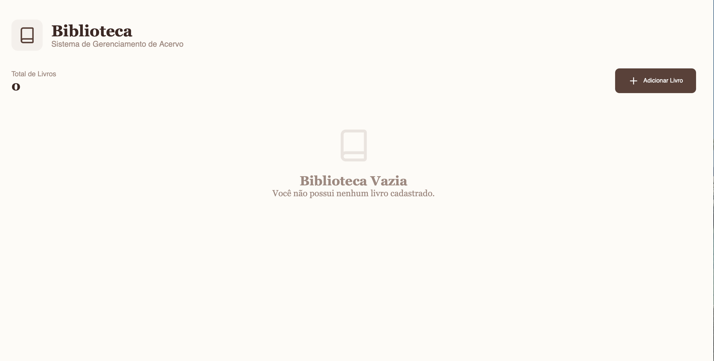
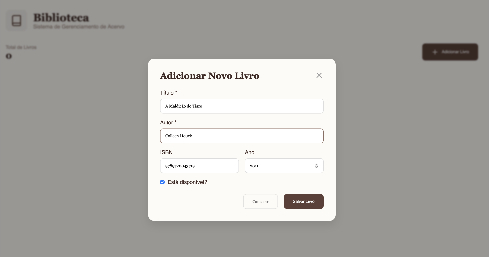
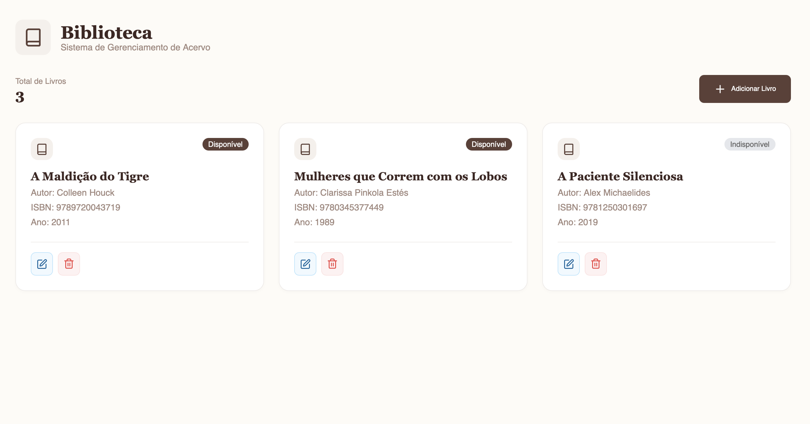

# API Web Biblioteca (Entidade Livro)


**Disciplina:** `Arquitetura e Desenvolvimento Back-end`  
**Professor:** `Danilo Farias`  
**Instituição:** `Faculdade Senac`  
**Período:** `2025.2`

## Objetivo

Este projeto consiste no desenvolvimento de uma **API Web backend** para um sistema de gerenciamento de biblioteca, focando na implementação das operações CRUD (Create, Read, Update, Delete) para a entidade **Livro**.

O projeto segue uma arquitetura simplificada de **Controller/Repository**, garantindo a separação de responsabilidades entre a lógica de negócio e a persistência de dados.

## Telas do Projeto

### 1. Tela Inicial (Acervo Vazio)
Visualização inicial quando não há livros cadastrados no sistema.  


### 2. Cadastro de Livro
Modal intuitivo e responsivo para a inserção de novos títulos ao acervo.  


### 3. Visualização e Gerenciamento do Acervo
Listagem completa dos livros com indicadores visuais de disponibilidade e opções para **Editar** ou **Excluir**.  


## Tecnologias Utilizadas

- **Node.js & Express:** Framework para construção do servidor web.  
- **TypeScript:** Tipagem estática e segurança no código.  
- **TypeORM:** ORM para comunicação com o banco de dados.  
- **SQLite:** Banco de dados relacional simples e leve.  
- **Arquitetura em Camadas:** Separação entre Controllers (lógica) e Repositories (persistência).  


## Endpoints Implementados

| Operação      | Método | Rota               | Descrição                                 |
|---------------|--------|--------------------|---------------------------------------------|
| **Criar**     | POST   | `/api/livros`      | Cadastra um novo livro.                     |
| **Ler Todos** | GET    | `/api/livros`      | Retorna a lista completa de livros.         |
| **Ler por ID**| GET    | `/api/livros/{id}` | Retorna os detalhes de um livro específico. |
| **Atualizar** | PUT    | `/api/livros/{id}` | Atualiza as informações de um livro.        |
| **Excluir**   | DELETE | `/api/livros/{id}` | Remove um livro do sistema.                 |

## Como Executar o Projeto

O projeto possui dois diretórios:  
- `/backend` → API  
- `/frontend` → Interface  

> Ambos precisam estar rodando simultaneamente.

## Pré-requisitos

- **Node.js** (versão atual recomendada)  
- **Git**

## 1. Clonar o Repositório

```bash
git clone https://github.com/gislanysa/bibliotecaapi.git
cd bibliotecaapi
```
## 2. Rodar o Backend

Acesse a pasta backend
```bash
cd backend
```

Instale as dependências
```bash
npm install
```

Inicie o servidor
```bash
npm run dev
```

## 3. Rodar o Frontend

Volte para a raiz do projeto (se necessário)
cd ..

Acesse a pasta frontend
```bash
cd frontend
```

Instale as dependências
```bash
npm install
```

Inicie o projeto React
```bash
npm run dev
```
